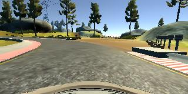
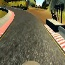
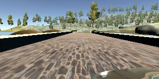
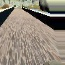
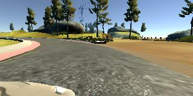
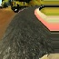

# Self Driving Car Nanodegree Project 3 - Behavior cloning
The idea of the project is to clone the behavior of the vehicle based on simulator data that is produced similarly to 
the real human driving.
### Introduction
In this project we start with recording the images and corresponding steering angles in the simulator and after that - 
feeding this data to the constructed model in order to produce the model that is able to drive autonomously on the 
track.
### Dependencies
This project uses Python 3.5.x and the following dependencies:
- [Keras](https://keras.io/)
- [NumPy](http://www.numpy.org/)
- [SciPy](https://www.scipy.org/)
- [TensorFlow](http://tensorflow.org)
- [OpenCV](http://opencv.org/)
- [Sklearn](http://scikit-learn.org/)

### How to run
In order to evaluate the model please run the command in terminal
`python drive.py model.json`
and run the simulator in the Autonomous mode.
## Pipeline
- Preprocess the data
- Generate the model
- Use the keras generator to fit the data to the model
- Evaluate the model on the track
## Data preprocessing
In the beginning I've started almost without any preprocessing of the images, the only thing I've used was resizing. 
In order to increase images quantity and training quality - I've decided that flipping them would be also a nice idea.

I was able to drive the model autonomously this way, but not that good. 

Next thing I've found out is that we don't really need the top and the bottom of the image and I've decided to crop it.

After that I've thought about other preprocessing ways and I've come to the conclusion that I can randomly rotate 
image and change their gamma level ([Article](http://www.pyimagesearch.com/2015/10/05/opencv-gamma-correction/)). This also had
improved the model. 

Furthermore I've decided to use the left and right images thus increasing the number of images in the data set, for that
this article was really helpful ([Article](https://medium.com/@billzito/my-first-self-driving-car-e9cd5c04f0f2#.xnnilhery)).

In the end I've read about images shearing and included that also as a part oof preprocessing package 
([Article](https://medium.com/@ksakmann/behavioral-cloning-make-a-car-drive-like-yourself-dc6021152713#.7k8vfppvk)).

So all resulting constants were defined experimentally to produce best results and resulting images - are squares 65x65 
pixels, having different distortions applied to them. 
Here are examples of images before and after preprocessing:

Before | After
------------|---------------
 | 
 | 
 | 

## Model architecture
I've decided to use the architecture suggested in the 
[Nvidia article](http://images.nvidia.com/content/tegra/automotive/images/2016/solutions/pdf/end-to-end-dl-using-px.pdf) 
and here what I have:

- Lambda                (None, 65, 65, 3)             
- Convolution2D  (None, 33, 33, 24)                   
- LeakyReLU         (None, 33, 33, 24)
- MaxPooling2D    (None, 32, 32, 24)               
- Convolution2D  (None, 16, 16, 36)             
- LeakyReLU          (None, 16, 16, 36)            
- MaxPooling2D    (None, 15, 15, 36)             
- Convolution2D  (None, 8, 8, 48)            
- LeakyReLU          (None, 8, 8, 48)           
- Dropout              (None, 8, 8, 48)             
- MaxPooling2D    (None, 7, 7, 48)                 
- Convolution2D  (None, 5, 5, 64)             
- LeakyReLU          (None, 5, 5, 64)            
- MaxPooling2D    (None, 4, 4, 64)            
- Convolution2D  (None, 2, 2, 64)             
- LeakyReLU          (None, 2, 2, 64)            
- MaxPooling2D    (None, 1, 1, 64)               
- Flatten              (None, 64)             
- Dense                  (None, 100)                
- LeakyReLU          (None, 100)                    
- Dropout              (None, 100)                
- Dense                  (None, 50)                
- LeakyReLU          (None, 50)                  
- Dense                  (None, 10)               
- LeakyReLU          (None, 10)                      
- Dense                  (None, 1)  
         
Firstly I've considered trying transfer lerning and using VGG16, VGG19 or ResNet50 from keras applications
pretrained on imagenet data, but I've experienced difficulties calculating that on my pretty old Nvidia video adapter
and on the CPU - it was taking too much time. So I decided to stick with the initial solution with Nvidia network.

This architecture worked pretty good in different conditions so basically I haven't changed it much: the only thing - 
experiments with dropout layers.

Another thing I've considered here is keras generator usages, since there is quite a lot of data and it's hard and 
inefficient to keep everything in memory. Keras generator worked quite well and I was able to fit the model with it.
Additionally I provided a way to fine tune the model, but actually haven't used this approach that much.
## Results
In this project, firstly I've build suitable network architecture, implemented different preprocessing technics and 
trained the model. In the end for training I've used training data provided by Udacity - they have given me the best 
results and the car behavior.

What I've found out is that MSE parameter actually haven't been really useful in this project. Because even when 
the loss was really small - our model could perform really bad on the track. So I think that MSE was not the best metric
for evaluation of this project. So mainly I've been using real track testing to test the model.
## Future Improvements
- Implement other preprocessing methods
- Try the transfer learning from the imagenet pretrained model and use it's results to improve the model
- Try the model in different simulated conditions (rain, night, etc). I think it won't perform that good
- Get a real car data and train the model on the real data could be really fun
